<p align="center"></p>

# Hired Hands

**Hireable mercenaries and workers for Minecraft 26.2 (NeoForge).** Pay them in emeralds and they
follow you, fight for you with the gear you give them, or work a trade (lumberjack, miner, farmer,
fisher, rancher, hauler, cook) and bring the results to a chest. They leave when their contract runs out.

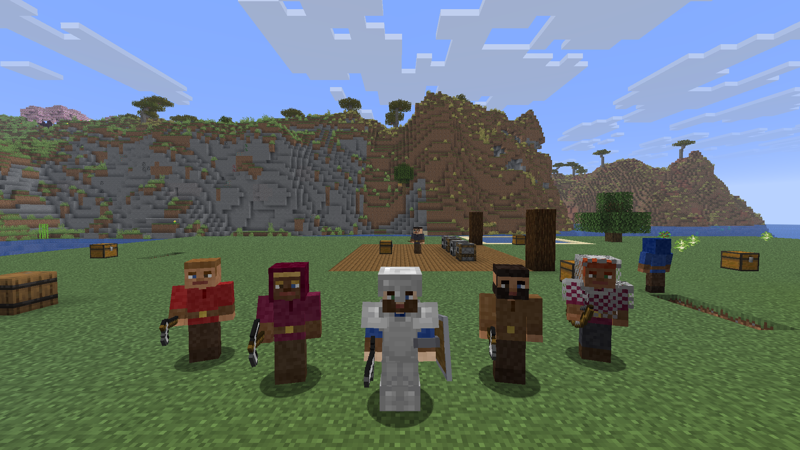

**📖 Wiki: [hired-hands-mod.vercel.app](https://hired-hands-mod.vercel.app)** ([español](https://hired-hands-mod.vercel.app/es/))

Available in English and Spanish. Each player sees messages, work states and the in-game handbook in
their own language. Chat orders are understood in both.

## Hiring

- **Free mercenaries** sometimes appear in village biomes (plains, savanna, taiga, snowy plains,
  desert) with random basic gear. Right-click one holding emeralds to hire it (10 emeralds = 5 days
  by default). Without emeralds it tells you its price.
- **Mercenary Contract** (shapeless: paper + iron sword + 5 emeralds): use it on the ground and a
  mercenary already hired by you appears.
- **Mercenary Spawn Egg** (creative): spawns a free mercenary.

Every item is in the **Hired Hands** creative tab.

Each emerald you give adds 1 day to the contract (sneak to pay the whole stack). They warn you when
less than a day is left. When it ends they become free again and keep their gear.

## Trades

The item in its main hand decides the trade:

| Give it | Trade | What it does |
|---|---|---|
| Sword, spear, bow, trident, mace | **Mercenary** | Fights. Follows you or guards a spot. |
| Axe | **Lumberjack** | Chops natural trees like a player (limited reach, pillars up tall trees), picks up saplings and replants. Never touches player-built leaves. |
| Pickaxe | **Miner** | Digs a real branch mine, or goes on expeditions through a Mine Entrance (see below). |
| Hoe | **Farmer** | Harvests and replants wheat, carrots, potatoes, beetroot, melons, pumpkins and sugar cane. |
| Fishing rod | **Fisher** | Finds open water, casts a real bobber and fishes with vanilla odds, treasure included. |
| Shears | **Rancher** | Shears, breeds up to 10 animals per species and culls the extras. |
| Bundle | **Hauler** | Carries everything from the chests in its area to the chest at its post. |
| Bowl | **Cook** | Loads furnaces and smokers with raw food and fuel, and brings the cooked food to the chest. |

| | |
|---|---|
| 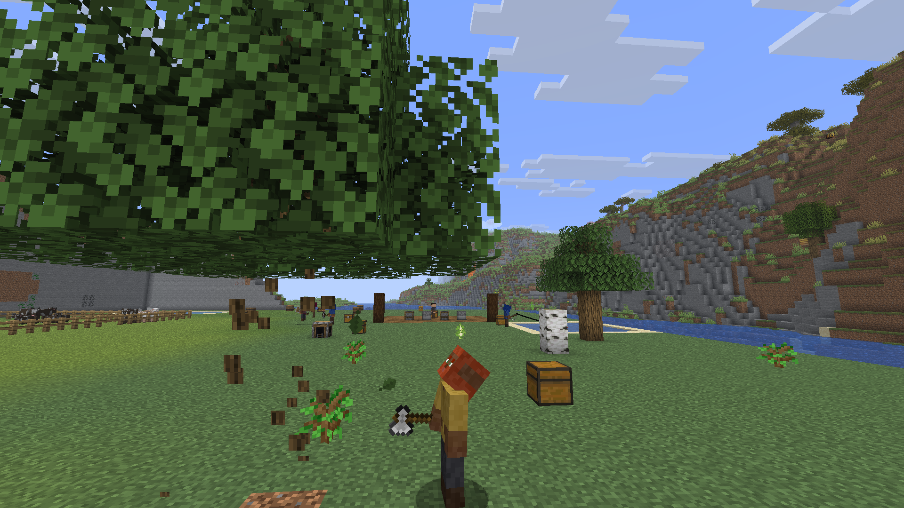 | 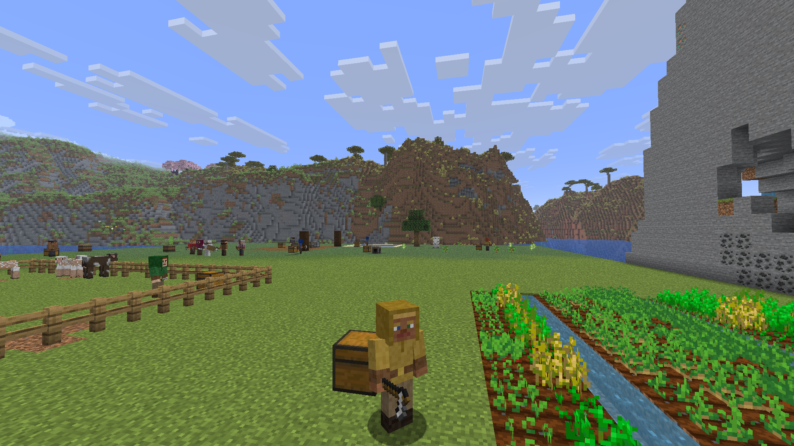 |
| 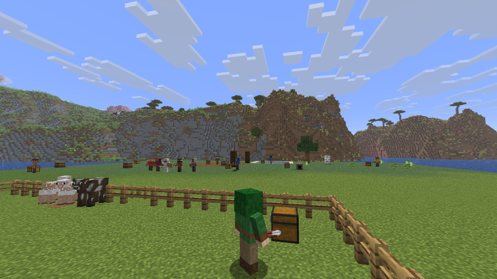 | 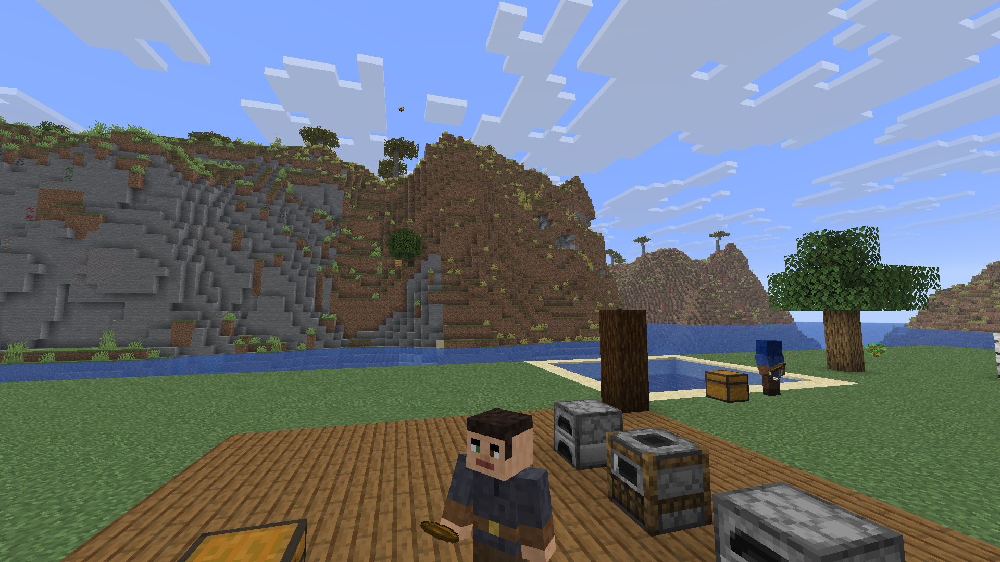 |
| 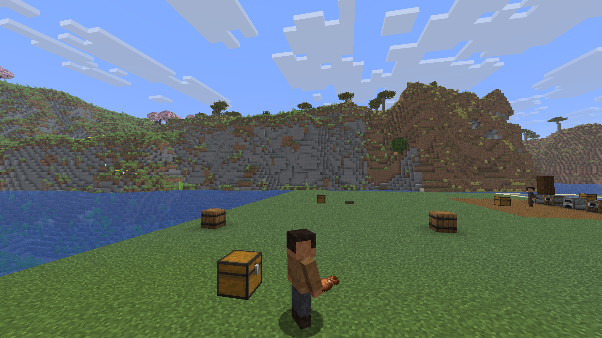 | 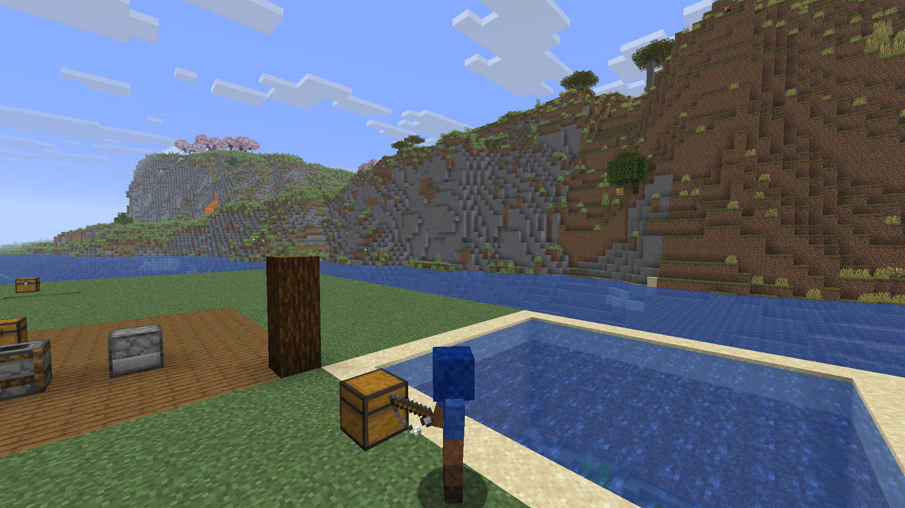 |

### Putting a worker to work

Right-click with an empty hand cycles its mode: **Following → Waiting → Working**. Mercenaries
cycle **Following ↔ On guard**.

Take the worker where you want it, click twice (Waiting, then Working) and place a **chest or
barrel** (vanilla or modded) within 5 blocks. That chest is:

- where it drops what it gathers,
- its **armory**: it never breaks a tool. With 2 uses left it swaps to a spare from its backpack or
  the chest and leaves the worn one for you to repair,
- its **pantry**: below half health it eats food from the chest.

At night workers stop (except miners underground) and sleep in a free bed within 8 blocks of their
post, healing three times faster.

### Miner

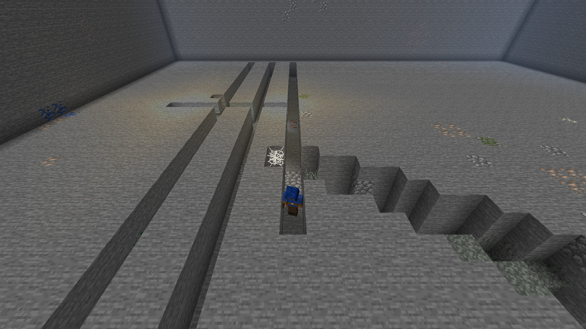

*(Cutaway: the rock above the mine was removed for the screenshot.)*

- **Real mine**: facing the way you were looking, it digs a staircase down to the best layer for its
  target ore (diamond and redstone Y −58, gold Y −16, lapis Y 0, iron Y 16, copper Y 48, coal Y 96),
  then a 64-block main tunnel with side branches. It mines every vein it sees, seals lava and water,
  floors over caves, replaces sand and gravel ceilings, lights the tunnel with torches and keeps 64
  stone for patching. Give it a target by clicking it with the ore (or by chat: "Garrick, find 10
  diamonds"); without one it mines at its own height and keeps everything.
- **Expeditions**: with a **Mine Entrance** within 4 blocks of its post it doesn't dig. It goes in,
  disappears for 5 minutes and comes back with ores that depend on the entrance's height and its
  pickaxe tier. It may come back hurt. The world is not touched.

## Management screen

Sneak + right-click with an empty hand opens its screen: a 3D preview, 6 equipment slots (drag
armor and tools in and out), its backpack, level and experience, health, contract days and what it
is doing. Buttons: Follow, Wait, Work and Group.

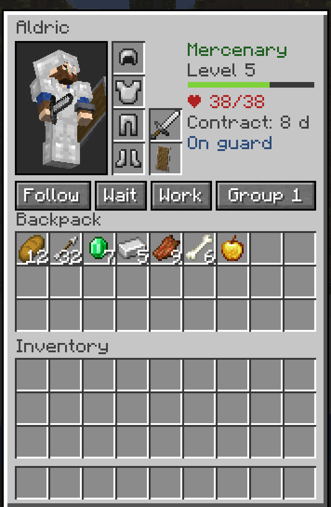

Other clicks: a **stick** gives back all its gear, **food** heals it, a **weapon, tool or armor**
equips it (and changes its trade).

## Levels

Workers and mercenaries level up (1 to 10) by working and fighting. Each level adds 2 health and 0.5
damage and makes them work 4 % faster; miners bring back more from expeditions.

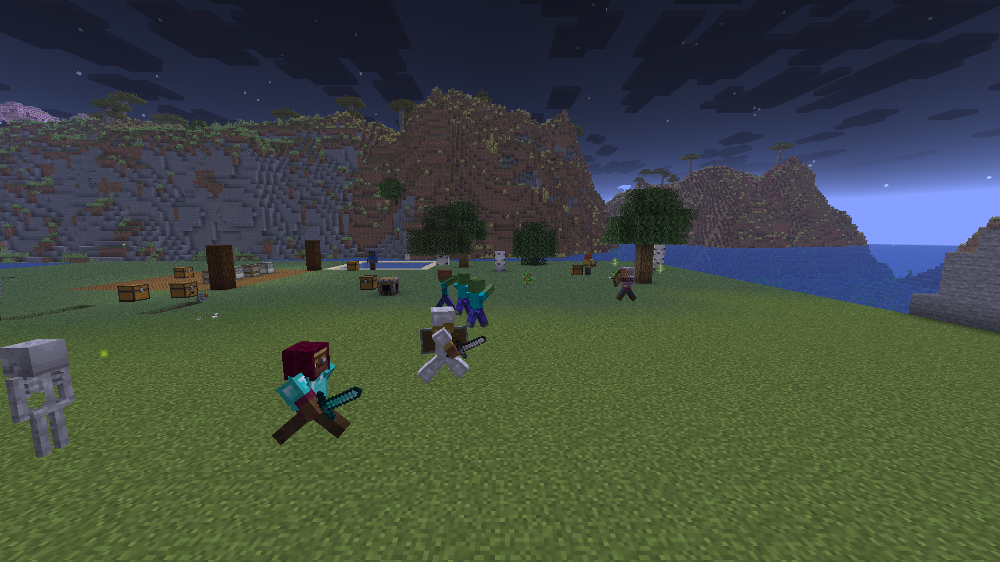

## Groups and the Command Horn

- Set a group (1 to 4) in its screen, then give orders in chat: `all, follow me`, `group 2, stay`.
- **Command Horn** (2 bones + leather + gold ingot): right-click and everyone within 48 blocks
  follows you; sneak and they wait where they are.

## Work area

**Foreman's Rod** (stick + gold nugget + red dye): right-click two blocks to mark an area (up to
64×64), then right-click a worker: it works only there. Sneak-click it to clear the area. While
holding the rod you see the edges of your workers' areas.

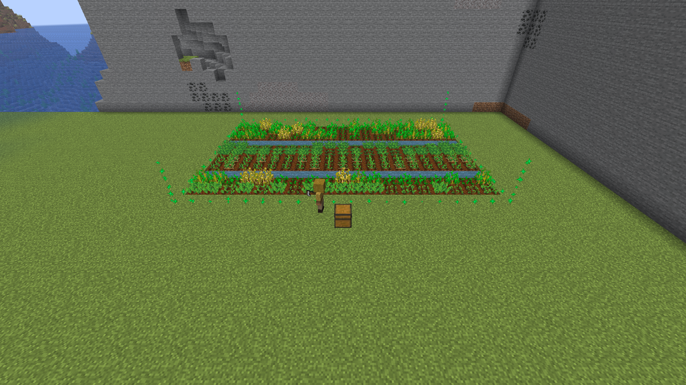

## Talking to them

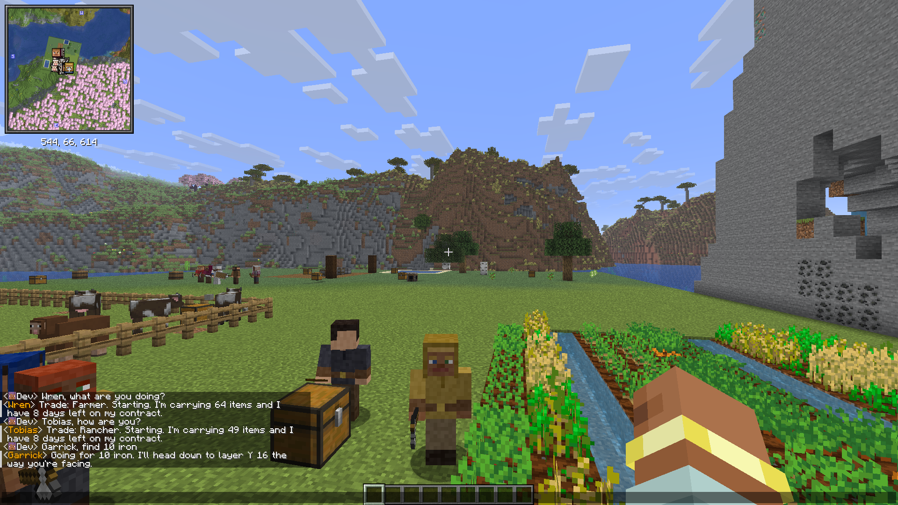

- **Greetings**: your hired hands greet you when you come near; free mercenaries offer their
  services. No AI involved.
- **Chat orders**: start the message with its first name and a comma or colon. Simple orders work
  **without any AI**, instantly and for free:

  | You say | It does |
  |---|---|
  | follow me, come | Follows you |
  | stay, wait, hold | Waits where it is |
  | guard, defend | Guards the spot where you are (switches to mercenary) |
  | chop / mine / harvest / fish / shear / haul / cook | Switches to that trade (taking the tool from its backpack or chest) and works where you are |
  | find diamonds, find 10 iron | Becomes a miner and goes after that ore |
  | work | Works its trade where you are |
  | what are you doing?, status, how are you? | Tells you what it is doing, what it carries and its contract days |

  Spanish works too ("Garrick, sígueme", "busca diamantes").

- **Optional AI chat**: everything else (long sentences, negations, questions, small talk) can go to
  Claude, which understands the order, carries it out and replies in character, remembering the last
  few exchanges. It is **off unless the server owner adds an Anthropic API key**; see Configuration.

## In-game handbook

The **Patron's Handbook** explains all of this in game. Every player gets one the first time they
hire someone, and it can be crafted from a book and an emerald.

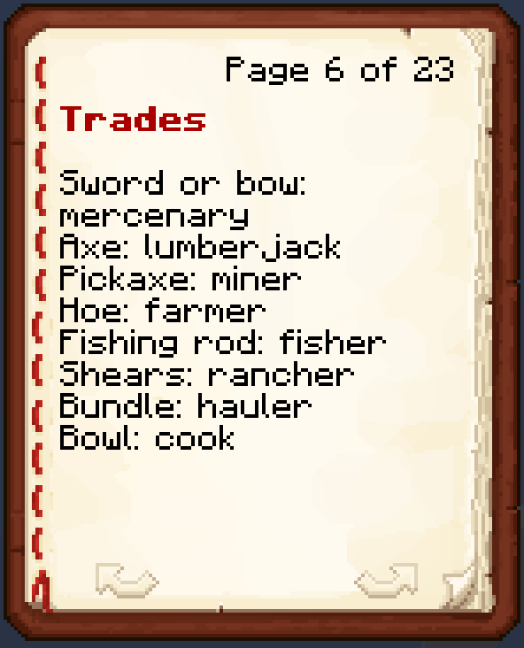

## Recipes

| Item | Recipe |
|---|---|
| Mercenary Contract | 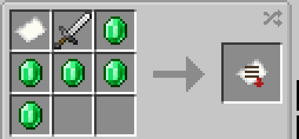 |
| Patron's Handbook | 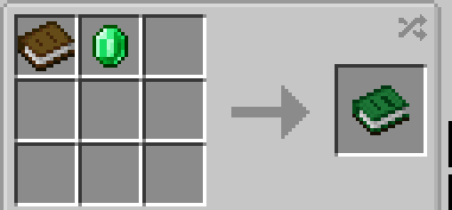 |
| Command Horn | 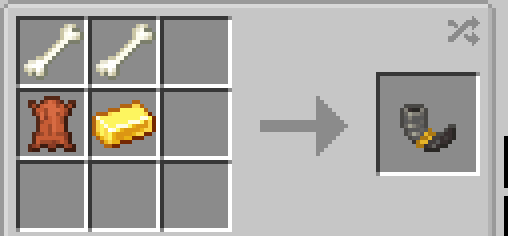 |
| Foreman's Rod | 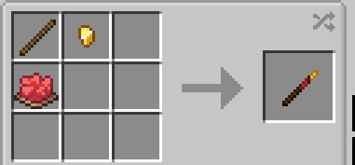 |
| Mine Entrance | 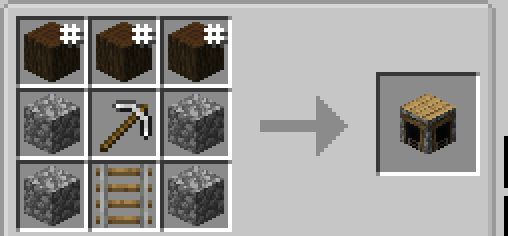 |

## Requirements

| | |
|---|---|
| Minecraft | 26.2 |
| NeoForge | 26.2.0.82 or newer |
| Other mods | none required |

Install on **both server and clients** (it adds a new entity and a screen).

Workers only work while their chunk is loaded. Contracts and expeditions count world time, so they
keep running while nobody is online.

## Configuration

`config/hired_hands-server.toml` (created on first server start, reloads without restart):

| Key | Default | Meaning |
|---|---|---|
| `costo_contratacion` | 10 | Emeralds to hire a free mercenary |
| `dias_contrato` | 5 | Days included when hiring or using a contract |
| `dias_por_esmeralda` | 1 | Extra days per emerald |
| `radio_guardia` | 12 | Fighting radius around a guard post |
| `radio_trabajo` | 16 | Work radius around a post (when no area is set) |
| `lentitud_trabajo` | 2.0 | Time to break a block compared to a player |
| `largo_tunel` | 64 | Maximum length of the miner's main tunnel |
| `segundos_pesca` | 30 | Average seconds between fish |
| `ganado_maximo` | 10 | Animals per species the rancher keeps |

`[expedicion]` section (miner with a Mine Entrance):

| Key | Default | Meaning |
|---|---|---|
| `duracion_segundos` | 300 | Time inside the mine per trip |
| `descanso_segundos` | 20 | Rest after coming back |
| `vida_minima_porcentaje` | 70 | Won't go in with less health; waits to heal |
| `vetas` | 5 | Veins found per trip (the main loot knob) |
| `probabilidad_herido` | 10 | % chance of coming back hurt (never dies) |
| `desgaste_pico` | 20 | Pickaxe uses per trip (never breaks it) |

### AI chat (optional, server only)

`config/hired_hands-common.toml` on the **server**. This file is never sent to players.

```toml
[ia]
    activada = true
    clave_api = "sk-ant-..."
    modelo = "claude-haiku-4-5"
    llamadas_por_minuto = 6
```

The key can also come from the `ANTHROPIC_API_KEY` environment variable. The default model, Claude
Haiku 4.5, is the cheapest; each player can send up to 6 AI messages per minute. Without a key,
greetings and simple orders work exactly the same.

Recipes, spawn weights and biomes are data files under `data/hired_hands/` and can be changed with a
datapack.

## Compatibility notes

- Carry On cannot pick up hired hands (they are on its entity blacklist), so sneak + right-click
  always opens their screen.

## Building

Requires Java 25.

```
gradlew build
```

The jar is written to `build/libs/`.

## License

MIT. See [LICENSE](LICENSE).
